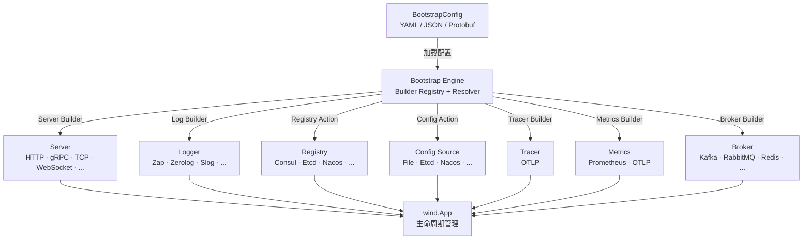

<p align="center">
  <h1 align="center">GoWind Bootstrap · 声明式应用引导框架</h1>
  <p align="center">
    配置即应用 · 一行代码启动微服务
  </p>
  <p align="center">
    <em>用一份声明式配置，组装完整微服务应用——传输层、配置中心、注册发现、日志、追踪、指标、消息代理，一气呵成</em>
  </p>
</p>

<p align="center">
  <a href="README.md">中文</a> · <a href="README_en.md">English</a> · <a href="README_ja.md">日本語</a>
</p>

<p align="center">
  
  
  
  
  
  
</p>

---

## 项目亮点

- **声明式配置驱动**：基于 Protobuf 定义的 `BootstrapConfig`，一份 YAML 配置即可描述完整的应用拓扑——传输层、配置中心、注册发现、日志、追踪、指标、消息代理
- **SPI 插件注册机制**：通过 `init()` + 空导入实现 Builder 自注册，零胶水代码即可扩展新组件
- **声明式中间件编排**：HTTP/gRPC 中间件通过配置启用和参数化，无需手写一行中间件初始化代码
- **三层封装，灵活切换**：从一行代码启动的全密封模式，到手写 Builder 的完全开放模式，按需选择
- **多模块依赖隔离**：每个适配子包独立 `go.mod`，用户只引入需要的适配器，不污染依赖树
- **Cobra 命令行集成**：内置命令行支持，通过 `-c` 参数指定配置文件，开箱即用
- **多格式配置支持**：自动识别 YAML / JSON / Protobuf 二进制格式，平滑迁移

---

## 快速开始

### 安装

```bash
go get github.com/tx7do/go-wind-bootstrap
```

### 最简示例

**config.yaml**

```yaml
app:
  id: my-service
  name: my-service
  version: "1.0.0"
  env: development

server:
  http:
    addr: ":8080"
    middleware:
      recovery: {}
      cors: {}
      logging: {}

logger:
  type: zap
  zap:
    level: info
    format: json
```

**main.go**

```go
package main

import (
    "fmt"
    "net/http"
    "os"

    bootstrap "github.com/tx7do/go-wind-bootstrap"
    _ "github.com/tx7do/go-wind-bootstrap/log/zap"
    httpAdapter "github.com/tx7do/go-wind-bootstrap/transport/http"
)

func main() {
    httpAdapter.RegisterServerSetup(func(srv *httpAdapter.Server) {
        srv.GET("/", func(w http.ResponseWriter, r *http.Request) {
            _, _ = fmt.Fprintf(w, "Hello, GoWind!\n")
        })
    })

    if err := bootstrap.RunAppWithFlags(bootstrap.NewCommandFlags()); err != nil {
        os.Exit(1)
    }
}
```

```bash
# 启动
go run main.go

# 指定配置文件
go run main.go -c /path/to/config.yaml

# 测试
curl http://localhost:8080
```

---

## 设计理念

### 配置即应用

`go-wind-bootstrap` 的核心思想是**声明式配置驱动**。应用的完整拓扑——从传输层到消息代理——全部通过一份 Protobuf 定义的 `BootstrapConfig` 描述。引导引擎读取配置，通过注册的 Builder 自动组装 `wind.App`：

```
BootstrapConfig → Builder Registry → wind.Option Chain → wind.App
```

### SPI 自注册模式

每个适配子包通过 `init()` + 空导入将 Builder 注册到全局注册表。用户只需导入对应的适配器包，框架自动完成组件创建：

```go
import (
    _ "github.com/tx7do/go-wind-bootstrap/log/zap"           // 注册 Zap Logger Builder
    _ "github.com/tx7do/go-wind-bootstrap/transport/http"     // 注册 HTTP Server Builder
    _ "github.com/tx7do/go-wind-bootstrap/transport/grpc"     // 注册 gRPC Server Builder
)
```

### 声明式中间件

HTTP 和 gRPC 中间件通过配置文件的 optional 字段启用，参数也通过配置传入。无需编写初始化代码：

```yaml
server:
  http:
    addr: ":8080"
    middleware:
      recovery:
        stack_trace: true
      cors:
        allowed_origins:
          - "*"
        allowed_methods:
          - GET
          - POST
      logging:
        skip_paths:
          - /health
      request_id:
        header_name: X-Request-ID
```

---

## 三层 API 封装

| 层次      | API                          | 适用场景                              |
|---------|------------------------------|-----------------------------------|
| **全密封** | `RunApp` / `RunAppWithFlags` | 一行代码启动，自动处理信号监听、配置加载、生命周期         |
| **半密封** | `BootstrapWithContext`       | 需要访问 `Context`（配置、App、Cancel）进行定制 |
| **开放**  | `Bootstrap` / `Run`          | 完全手动控制每一步，适合高级场景                  |

### 全密封模式

```go
// 最简单：一行启动
bootstrap.RunApp("config.yaml")

// 带 Cobra 命令行
bootstrap.RunAppWithFlags(bootstrap.NewCommandFlags())
```

### 半密封模式

```go
bctx, err := bootstrap.BootstrapWithContext(nil, cfg)
if err != nil {
    log.Fatal(err)
}
defer bctx.Cleanup()

// 可在运行前操作 Context
fmt.Println(bctx.Config().GetApp().GetName())

bctx.App().Run(bctx)
```

### 开放模式

```go
cfg, _ := bootstrap.LoadConfigFromFile("config.yaml")
app, cleanup, err := bootstrap.Bootstrap(ctx, cfg)
if err != nil {
    log.Fatal(err)
}
defer cleanup()

app.Run(ctx)
```

---

## 架构总览



---

## 支持的组件

### 传输层（Server）

| 类型 | 常量 | 适配器 |
|------|------|--------|
| HTTP | `http` | `transport/http` ✅ |
| gRPC | `grpc` | `transport/grpc` ✅ |
| HTTP/3 | `http3` | — |
| GraphQL | `graphql` | — |
| SSE | `sse` | — |
| WebSocket | `websocket` | — |
| TCP | `tcp` | — |
| UDP | `udp` | — |
| KCP | `kcp` | — |
| Thrift | `thrift` | — |
| tRPC | `trpc` | — |
| WebTransport | `webtransport` | — |

### 日志（Logger）

| 类型 | 常量 |
|------|------|
| Zap ✅ | `zap` |
| Zerolog | `zerolog` |
| Slog | `slog` |
| Logrus | `logrus` |
| Charm | `charm` |
| Phuslu | `phuslu` |
| Loki | `loki` |
| Sentry | `sentry` |
| 阿里云 | `aliyun` |
| 腾讯云 | `tencent` |
| CloudWatch | `cloudwatch` |

### 配置中心（Config）

| 类型 | 常量 |
|------|------|
| File | `file` |
| Etcd | `etcd` |
| Nacos | `nacos` |
| Consul | `consul` |
| Apollo | `apollo` |
| Kubernetes | `kubernetes` |
| Redis | `redis` |
| Zookeeper | `zookeeper` |
| Vault | `vault` |
| Polaris | `polaris` |

### 服务注册发现（Registry）

| 类型 | 常量 |
|------|------|
| Consul | `consul` |
| Etcd | `etcd` |
| Nacos | `nacos` |
| Zookeeper | `zookeeper` |
| Polaris | `polaris` |
| Eureka | `eureka` |
| Kubernetes | `kubernetes` |
| ServiceComb | `service_comb` |

### 分布式追踪（Tracer）

| 类型 | 常量 |
|------|------|
| OTLP | `otlp` |

### 指标监控（Metrics）

| 类型 | 常量 |
|------|------|
| Prometheus | `prometheus` |
| OTLP | `otlp` |

### 消息代理（Broker）

| 类型 | 常量 |
|------|------|
| Kafka | `kafka` |
| RabbitMQ | `rabbitmq` |
| Redis | `redis` |
| NATS | `nats` |
| MQTT | `mqtt` |
| Pulsar | `pulsar` |
| Azure Service Bus | `azuresb` |
| Google Pub/Sub | `gcpubsub` |
| NSQ | `nsq` |
| RocketMQ | `rocketmq` |
| SQS | `sqs` |
| STOMP | `stomp` |

---

## 声明式中间件

### HTTP 中间件

| 中间件 | 配置字段 | 说明 |
|--------|---------|------|
| Recovery | `recovery` | 异常恢复，可选 `stack_trace` |
| CORS | `cors` | 跨域资源共享，支持 `allowed_origins/methods/headers` 等 |
| Logging | `logging` | 请求日志，可选 `skip_paths` |
| Request ID | `request_id` | 请求 ID 注入，可选 `header_name` |
| Tracing | `tracing` | OpenTelemetry 链路追踪 |
| Rate Limit | `rate_limit` | 限流 |
| Timeout | `timeout` | 请求超时 |

### gRPC 中间件

| 中间件 | 配置字段 | 说明 |
|--------|---------|------|
| Recovery | `recovery` | 异常恢复 |
| Logging | `logging` | 请求日志 |
| Tracing | `tracing` | OpenTelemetry 链路追踪 |
| Validate | `validate` | 请求校验 |

---

## 路由注册

### 追加式注册（推荐）

适配器提供 `RegisterServerSetup` 追加式注册 API，支持代码生成器和手写代码共存：

```go
// generated_routes.go（代码生成器自动生成）
func init() {
    httpAdapter.RegisterServerSetup(func(srv *httpAdapter.Server) {
        srv.GET("/v1/users", listUsers)
        srv.POST("/v1/users", createUser)
    })
}
```

```go
// main.go（用户手写代码）
func init() {
    httpAdapter.RegisterServerSetup(func(srv *httpAdapter.Server) {
        srv.GET("/health", healthCheck)
    })
}
```

### gRPC 服务注册

```go
grpcAdapter.RegisterServiceRegistrar(func(srv *grpc.Server) {
    pb.RegisterGreeterServer(srv, &greeterService{})
})
```

---

## 项目结构

```
go-wind-bootstrap/
├── conf/                        # 独立 go.mod · Protobuf 配置定义
│   └── proto/bootstrap/v1/      # .proto 源文件
│       ├── bootstrap.proto      # 顶层 BootstrapConfig
│       ├── app.proto            # 应用元数据
│       ├── server.proto         # 传输层 + 中间件配置
│       ├── config.proto         # 配置中心
│       ├── registry.proto       # 服务注册发现
│       ├── log.proto            # 日志系统
│       ├── tracer.proto         # 分布式追踪
│       ├── metrics.proto        # 指标监控
│       └── broker.proto         # 消息代理
├── *.go                         # 根 go.mod · 引导引擎核心
│   ├── bootstrap.go             # 入口：Bootstrap / Run / RunApp
│   ├── builder.go               # Builder 注册表（SPI）
│   ├── context.go               # Context 生命周期封装
│   ├── cli.go                   # Cobra 命令行封装
│   ├── types.go                 # 组件类型常量
│   ├── server_builder.go        # Server 解析器
│   ├── config_builder.go        # Config 解析器
│   ├── registry_builder.go      # Registry 解析器
│   ├── log_builder.go           # Logger 解析器
│   ├── tracer_builder.go        # Tracer 解析器
│   ├── metrics_builder.go       # Metrics 解析器
│   └── broker_builder.go        # Broker 解析器
├── log/zap/                     # 独立 go.mod · Zap Logger 适配器
├── transport/http/              # 独立 go.mod · HTTP 适配器 + 中间件 + std driver
├── transport/grpc/              # 独立 go.mod · gRPC 适配器 + 中间件
└── _examples/
    ├── quickstart/              # 最简示例：一行代码启动
    ├── yaml_config/             # YAML 配置加载示例
    └── custom_builder/          # 自定义 Builder 示例
```

---

## 技术栈

| 层级 | 技术 | 说明 |
|------|------|------|
| 语言 | Go 1.22+ | 高性能编译型语言 |
| 框架 | go-wind | 微服务生命周期骨架 |
| 插件 | go-wind-plugins | 可插拔功能模块库 |
| 配置定义 | Protobuf + buf.build | 声明式配置，契约优先 |
| 配置格式 | YAML / JSON / Protobuf Binary | 多格式自动识别 |
| 命令行 | Cobra | CLI 参数解析 |

---

## 扩展自定义 Builder

当内置适配器不满足需求时，可以注册自定义 Builder：

```go
// 注册自定义 Registry Builder
bootstrap.MustRegisterRegistryAction(bootstrap.RegistryTypeConsul,
    func(ctx context.Context, appCfg *v1.App, endpoints []string) (func(), error) {
        // 创建 Consul 注册中心...
        return func() { /* cleanup */ }, nil
    },
)

// 注册自定义 Broker Builder
bootstrap.MustRegisterBrokerBuilder(bootstrap.BrokerTypeKafka,
    func(ctx context.Context, cfg *v1.Broker) (func(), error) {
        // 创建 Kafka Broker...
        return func() { /* cleanup */ }, nil
    },
)
```

---

## 相关项目

| 项目 | 说明 |
|------|------|
| [go-wind](https://github.com/tx7do/go-wind) | 微服务生命周期骨架 |
| [go-wind-plugins](https://github.com/tx7do/go-wind-plugins) | 可插拔功能模块库 |

---

## License

[MIT License](LICENSE)
