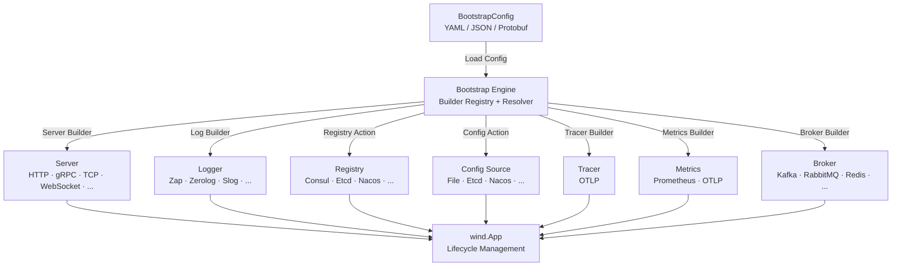

<p align="center">
  <h1 align="center">GoWind Bootstrap · Declarative Application Bootstrapper</h1>
  <p align="center">
    Configuration-as-Application · Launch Microservices in One Line
  </p>
  <p align="center">
    <em>Assemble a complete microservice application from a single declarative config — transport, config center, service discovery, logging, tracing, metrics, message broker, all at once</em>
  </p>
</p>

<p align="center">
  <a href="README.md">中文</a> · <a href="README_en.md">English</a> · <a href="README_ja.md">日本語</a>
</p>

<p align="center">
  
  
  
  
  
  
</p>

---

## Highlights

- **Declarative Configuration-Driven**: Define the entire application topology — transport, config center, service discovery, logging, tracing, metrics, message broker — in a single Protobuf-based `BootstrapConfig` YAML file
- **SPI Plugin Registration**: Builders self-register via `init()` + blank import. Extend with new components using zero glue code
- **Declarative Middleware Orchestration**: Enable and parameterize HTTP/gRPC middleware through configuration. No middleware initialization code required
- **Three-Layer API Encapsulation**: From one-line sealed launch to fully open hand-written builders — choose the level of control you need
- **Multi-Module Dependency Isolation**: Each adapter sub-package has its own `go.mod`. Users only import the adapters they need — no dependency tree pollution
- **Cobra CLI Integration**: Built-in command-line support with `-c` flag for config file path, ready out of the box
- **Multi-Format Config Support**: Auto-detects YAML / JSON / Protobuf binary formats for smooth migration

---

## Quick Start

### Install

```bash
go get github.com/tx7do/go-wind-bootstrap
```

### Minimal Example

**config.yaml**

```yaml
app:
  id: my-service
  name: my-service
  version: "1.0.0"
  env: development

server:
  http:
    addr: ":8080"
    middleware:
      recovery: {}
      cors: {}
      logging: {}

logger:
  type: zap
  zap:
    level: info
    format: json
```

**main.go**

```go
package main

import (
    "fmt"
    "net/http"
    "os"

    bootstrap "github.com/tx7do/go-wind-bootstrap"
    _ "github.com/tx7do/go-wind-bootstrap/log/zap"
    httpAdapter "github.com/tx7do/go-wind-bootstrap/transport/http"
)

func main() {
    httpAdapter.RegisterServerSetup(func(srv *httpAdapter.Server) {
        srv.GET("/", func(w http.ResponseWriter, r *http.Request) {
            _, _ = fmt.Fprintf(w, "Hello, GoWind!\n")
        })
    })

    if err := bootstrap.RunAppWithFlags(bootstrap.NewCommandFlags()); err != nil {
        os.Exit(1)
    }
}
```

```bash
# Start
go run main.go

# Specify config file
go run main.go -c /path/to/config.yaml

# Test
curl http://localhost:8080
```

---

## Design Philosophy

### Configuration-as-Application

The core idea of `go-wind-bootstrap` is **declarative configuration-driven** development. The complete application topology — from transport to message broker — is described by a Protobuf-defined `BootstrapConfig`. The bootstrap engine reads the config and automatically assembles a `wind.App` through registered builders:

```
BootstrapConfig → Builder Registry → wind.Option Chain → wind.App
```

### SPI Self-Registration

Each adapter sub-package registers its Builder into the global registry via `init()` + blank import. Users simply import the adapter package, and the framework handles component creation automatically:

```go
import (
    _ "github.com/tx7do/go-wind-bootstrap/log/zap"           // Register Zap Logger Builder
    _ "github.com/tx7do/go-wind-bootstrap/transport/http"     // Register HTTP Server Builder
    _ "github.com/tx7do/go-wind-bootstrap/transport/grpc"     // Register gRPC Server Builder
)
```

### Declarative Middleware

HTTP and gRPC middleware are enabled through optional fields in the configuration file, with parameters also passed via config. No initialization code needed:

```yaml
server:
  http:
    addr: ":8080"
    middleware:
      recovery:
        stack_trace: true
      cors:
        allowed_origins:
          - "*"
        allowed_methods:
          - GET
          - POST
      logging:
        skip_paths:
          - /health
      request_id:
        header_name: X-Request-ID
```

---

## Three-Layer API

| Layer | API | Use Case |
|-------|-----|----------|
| **Sealed** | `RunApp` / `RunAppWithFlags` | One-line launch with automatic signal handling, config loading, and lifecycle management |
| **Semi-Sealed** | `BootstrapWithContext` | Access `Context` (config, App, Cancel) for customization |
| **Open** | `Bootstrap` / `Run` | Full manual control of every step, for advanced scenarios |

### Sealed Mode

```go
// Simplest: one-line launch
bootstrap.RunApp("config.yaml")

// With Cobra CLI
bootstrap.RunAppWithFlags(bootstrap.NewCommandFlags())
```

### Semi-Sealed Mode

```go
bctx, err := bootstrap.BootstrapWithContext(nil, cfg)
if err != nil {
    log.Fatal(err)
}
defer bctx.Cleanup()

// Access Context before running
fmt.Println(bctx.Config().GetApp().GetName())

bctx.App().Run(bctx)
```

### Open Mode

```go
cfg, _ := bootstrap.LoadConfigFromFile("config.yaml")
app, cleanup, err := bootstrap.Bootstrap(ctx, cfg)
if err != nil {
    log.Fatal(err)
}
defer cleanup()

app.Run(ctx)
```

---

## Architecture Overview



---

## Supported Components

### Transport (Server)

| Type | Constant | Adapter |
|------|----------|---------|
| HTTP | `http` | `transport/http` ✅ |
| gRPC | `grpc` | `transport/grpc` ✅ |
| HTTP/3 | `http3` | — |
| GraphQL | `graphql` | — |
| SSE | `sse` | — |
| WebSocket | `websocket` | — |
| TCP | `tcp` | — |
| UDP | `udp` | — |
| KCP | `kcp` | — |
| Thrift | `thrift` | — |
| tRPC | `trpc` | — |
| WebTransport | `webtransport` | — |

### Logger

| Type | Constant |
|------|----------|
| Zap ✅ | `zap` |
| Zerolog | `zerolog` |
| Slog | `slog` |
| Logrus | `logrus` |
| Charm | `charm` |
| Phuslu | `phuslu` |
| Loki | `loki` |
| Sentry | `sentry` |
| Alibaba Cloud | `aliyun` |
| Tencent Cloud | `tencent` |
| CloudWatch | `cloudwatch` |

### Config Source

| Type | Constant |
|------|----------|
| File | `file` |
| Etcd | `etcd` |
| Nacos | `nacos` |
| Consul | `consul` |
| Apollo | `apollo` |
| Kubernetes | `kubernetes` |
| Redis | `redis` |
| Zookeeper | `zookeeper` |
| Vault | `vault` |
| Polaris | `polaris` |

### Service Registry

| Type | Constant |
|------|----------|
| Consul | `consul` |
| Etcd | `etcd` |
| Nacos | `nacos` |
| Zookeeper | `zookeeper` |
| Polaris | `polaris` |
| Eureka | `eureka` |
| Kubernetes | `kubernetes` |
| ServiceComb | `service_comb` |

### Distributed Tracing

| Type | Constant |
|------|----------|
| OTLP | `otlp` |

### Metrics

| Type | Constant |
|------|----------|
| Prometheus | `prometheus` |
| OTLP | `otlp` |

### Message Broker

| Type | Constant |
|------|----------|
| Kafka | `kafka` |
| RabbitMQ | `rabbitmq` |
| Redis | `redis` |
| NATS | `nats` |
| MQTT | `mqtt` |
| Pulsar | `pulsar` |
| Azure Service Bus | `azuresb` |
| Google Pub/Sub | `gcpubsub` |
| NSQ | `nsq` |
| RocketMQ | `rocketmq` |
| SQS | `sqs` |
| STOMP | `stomp` |

---

## Declarative Middleware

### HTTP Middleware

| Middleware | Config Field | Description |
|------------|-------------|-------------|
| Recovery | `recovery` | Panic recovery, optional `stack_trace` |
| CORS | `cors` | Cross-Origin Resource Sharing, supports `allowed_origins/methods/headers`, etc. |
| Logging | `logging` | Request logging, optional `skip_paths` |
| Request ID | `request_id` | Request ID injection, optional `header_name` |
| Tracing | `tracing` | OpenTelemetry distributed tracing |
| Rate Limit | `rate_limit` | Rate limiting |
| Timeout | `timeout` | Request timeout |

### gRPC Middleware

| Middleware | Config Field | Description |
|------------|-------------|-------------|
| Recovery | `recovery` | Panic recovery |
| Logging | `logging` | Request logging |
| Tracing | `tracing` | OpenTelemetry distributed tracing |
| Validate | `validate` | Request validation |

---

## Route Registration

### Additive Registration (Recommended)

The adapter provides `RegisterServerSetup` for additive registration, supporting coexistence of code generators and hand-written code:

```go
// generated_routes.go (auto-generated by code generator)
func init() {
    httpAdapter.RegisterServerSetup(func(srv *httpAdapter.Server) {
        srv.GET("/v1/users", listUsers)
        srv.POST("/v1/users", createUser)
    })
}
```

```go
// main.go (hand-written user code)
func init() {
    httpAdapter.RegisterServerSetup(func(srv *httpAdapter.Server) {
        srv.GET("/health", healthCheck)
    })
}
```

### gRPC Service Registration

```go
grpcAdapter.RegisterServiceRegistrar(func(srv *grpc.Server) {
    pb.RegisterGreeterServer(srv, &greeterService{})
})
```

---

## Project Structure

```
go-wind-bootstrap/
├── conf/                        # Independent go.mod · Protobuf config definitions
│   └── proto/bootstrap/v1/      # .proto source files
│       ├── bootstrap.proto      # Top-level BootstrapConfig
│       ├── app.proto            # Application metadata
│       ├── server.proto         # Transport + middleware config
│       ├── config.proto         # Config center
│       ├── registry.proto       # Service discovery
│       ├── log.proto            # Logging system
│       ├── tracer.proto         # Distributed tracing
│       ├── metrics.proto        # Metrics monitoring
│       └── broker.proto         # Message broker
├── *.go                         # Root go.mod · Bootstrap engine core
│   ├── bootstrap.go             # Entry: Bootstrap / Run / RunApp
│   ├── builder.go               # Builder registry (SPI)
│   ├── context.go               # Context lifecycle wrapper
│   ├── cli.go                   # Cobra CLI wrapper
│   ├── types.go                 # Component type constants
│   ├── server_builder.go        # Server resolver
│   ├── config_builder.go        # Config resolver
│   ├── registry_builder.go      # Registry resolver
│   ├── log_builder.go           # Logger resolver
│   ├── tracer_builder.go        # Tracer resolver
│   ├── metrics_builder.go       # Metrics resolver
│   └── broker_builder.go        # Broker resolver
├── log/zap/                     # Independent go.mod · Zap Logger adapter
├── transport/http/              # Independent go.mod · HTTP adapter + middleware + std driver
├── transport/grpc/              # Independent go.mod · gRPC adapter + middleware
└── _examples/
    ├── quickstart/              # Minimal example: one-line launch
    ├── yaml_config/             # YAML config loading example
    └── custom_builder/          # Custom builder example
```

---

## Tech Stack

| Layer | Technology | Description |
|-------|-----------|-------------|
| Language | Go 1.22+ | High-performance compiled language |
| Framework | go-wind | Microservice lifecycle skeleton |
| Plugins | go-wind-plugins | Pluggable module library |
| Config Definition | Protobuf + buf.build | Declarative config, contract-first |
| Config Format | YAML / JSON / Protobuf Binary | Multi-format auto-detection |
| CLI | Cobra | CLI argument parsing |

---

## Extending with Custom Builders

When built-in adapters don't meet your needs, register custom builders:

```go
// Register custom Registry Builder
bootstrap.MustRegisterRegistryAction(bootstrap.RegistryTypeConsul,
    func(ctx context.Context, appCfg *v1.App, endpoints []string) (func(), error) {
        // Create Consul registry...
        return func() { /* cleanup */ }, nil
    },
)

// Register custom Broker Builder
bootstrap.MustRegisterBrokerBuilder(bootstrap.BrokerTypeKafka,
    func(ctx context.Context, cfg *v1.Broker) (func(), error) {
        // Create Kafka broker...
        return func() { /* cleanup */ }, nil
    },
)
```

---

## Related Projects

| Project | Description |
|---------|-------------|
| [go-wind](https://github.com/tx7do/go-wind) | Microservice lifecycle skeleton |
| [go-wind-plugins](https://github.com/tx7do/go-wind-plugins) | Pluggable module library |

---

## License

[MIT License](LICENSE)
