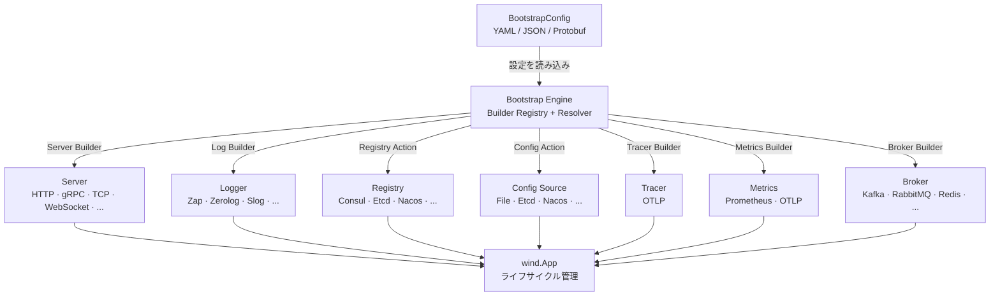

<p align="center">
  <h1 align="center">GoWind Bootstrap · 宣言型アプリケーションブートストラップフレームワーク</h1>
  <p align="center">
    設定即アプリ · ワンライナーでマイクロサービスを起動
  </p>
  <p align="center">
    <em>一枚の宣言型設定で、完全なマイクロサービスアプリケーションを組み立て — トランスポート、構成センター、サービスディスカバリ、ロギング、トレーシング、メトリクス、メッセージブローカーを一気に</em>
  </p>
</p>

<p align="center">
  <a href="README.md">中文</a> · <a href="README_en.md">English</a> · <a href="README_ja.md">日本語</a>
</p>

<p align="center">
  
  
  
  
  
  
</p>

---

## プロジェクトの特徴

- **宣言型設定駆動**：Protobuf で定義された `BootstrapConfig` により、トランスポート、構成センター、サービスディスカバリ、ロギング、トレーシング、メトリクス、メッセージブローカーを含む完全なアプリケーショントポロジーを一枚の YAML 設定で記述
- **SPI プラグイン登録メカニズム**：`init()` + ブランクインポートによる Builder 自動登録。グルーコード不要で新しいコンポーネントを拡張
- **宣言型ミドルウェアオーケストレーション**：HTTP/gRPC ミドルウェアを設定の optional フィールドで有効化・パラメータ化。ミドルウェア初期化コードの記述不要
- **3層 API カプセル化**：ワンライナー起動の完全シールドモードから、手書き Builder の完全オープンモードまで、ニーズに合わせて選択
- **マルチモジュール依存関係の分離**：各アダプタサブパッケージが独立した `go.mod` を持ち、必要なアダプタのみをインポート — 依存ツリーの汚染なし
- **Cobra CLI 統合**：`-c` フラグで設定ファイルパスを指定するコマンドラインサポートを内蔵、すぐに使用可能
- **マルチフォーマット設定サポート**：YAML / JSON / Protobuf バイナリ形式を自動識別、スムーズな移行を実現

---

## クイックスタート

### インストール

```bash
go get github.com/tx7do/go-wind-bootstrap
```

### 最小限の例

**config.yaml**

```yaml
app:
  id: my-service
  name: my-service
  version: "1.0.0"
  env: development

server:
  http:
    addr: ":8080"
    middleware:
      recovery: {}
      cors: {}
      logging: {}

logger:
  type: zap
  zap:
    level: info
    format: json
```

**main.go**

```go
package main

import (
    "fmt"
    "net/http"
    "os"

    bootstrap "github.com/tx7do/go-wind-bootstrap"
    _ "github.com/tx7do/go-wind-bootstrap/log/zap"
    httpAdapter "github.com/tx7do/go-wind-bootstrap/transport/http"
)

func main() {
    httpAdapter.RegisterServerSetup(func(srv *httpAdapter.Server) {
        srv.GET("/", func(w http.ResponseWriter, r *http.Request) {
            _, _ = fmt.Fprintf(w, "Hello, GoWind!\n")
        })
    })

    if err := bootstrap.RunAppWithFlags(bootstrap.NewCommandFlags()); err != nil {
        os.Exit(1)
    }
}
```

```bash
# 起動
go run main.go

# 設定ファイルを指定
go run main.go -c /path/to/config.yaml

# テスト
curl http://localhost:8080
```

---

## 設計思想

### 設定即アプリ

`go-wind-bootstrap` の中核思想は**宣言型設定駆動**です。トランスポートからメッセージブローカーまで、アプリケーションの完全なトポロジーはすべて Protobuf 定義の `BootstrapConfig` で記述されます。ブートストラップエンジンは設定を読み込み、登録された Builder を通じて `wind.App` を自動的に組み立てます：

```
BootstrapConfig → Builder Registry → wind.Option Chain → wind.App
```

### SPI 自己登録

各アダプタサブパッケージは `init()` + ブランクインポートで Builder をグローバルレジストリに登録します。ユーザーは対応するアダプタパッケージをインポートするだけで、フレームワークがコンポーネントの作成を自動的に行います：

```go
import (
    _ "github.com/tx7do/go-wind-bootstrap/log/zap"           // Zap Logger Builder を登録
    _ "github.com/tx7do/go-wind-bootstrap/transport/http"     // HTTP Server Builder を登録
    _ "github.com/tx7do/go-wind-bootstrap/transport/grpc"     // gRPC Server Builder を登録
)
```

### 宣言型ミドルウェア

HTTP と gRPC ミドルウェアは、設定ファイルの optional フィールドで有効化され、パラメータも設定から渡されます。初期化コードの記述は不要です：

```yaml
server:
  http:
    addr: ":8080"
    middleware:
      recovery:
        stack_trace: true
      cors:
        allowed_origins:
          - "*"
        allowed_methods:
          - GET
          - POST
      logging:
        skip_paths:
          - /health
      request_id:
        header_name: X-Request-ID
```

---

## 3層 API カプセル化

| 層 | API | ユースケース |
|----|-----|-------------|
| **シールド** | `RunApp` / `RunAppWithFlags` | ワンライナー起動、シグナルハンドリング・設定読み込み・ライフサイクル管理を自動化 |
| **セミシールド** | `BootstrapWithContext` | `Context`（設定、App、Cancel）にアクセスしてカスタマイズ |
| **オープン** | `Bootstrap` / `Run` | 各ステップを完全に手動制御、高度なシナリオ向け |

### シールドモード

```go
// 最もシンプル：ワンライナー起動
bootstrap.RunApp("config.yaml")

// Cobra CLI 付き
bootstrap.RunAppWithFlags(bootstrap.NewCommandFlags())
```

### セミシールドモード

```go
bctx, err := bootstrap.BootstrapWithContext(nil, cfg)
if err != nil {
    log.Fatal(err)
}
defer bctx.Cleanup()

// 実行前に Context にアクセス
fmt.Println(bctx.Config().GetApp().GetName())

bctx.App().Run(bctx)
```

### オープンモード

```go
cfg, _ := bootstrap.LoadConfigFromFile("config.yaml")
app, cleanup, err := bootstrap.Bootstrap(ctx, cfg)
if err != nil {
    log.Fatal(err)
}
defer cleanup()

app.Run(ctx)
```

---

## アーキテクチャ概要



---

## サポートコンポーネント

### トランスポート（Server）

| タイプ | 定数 | アダプタ |
|--------|------|---------|
| HTTP | `http` | `transport/http` ✅ |
| gRPC | `grpc` | `transport/grpc` ✅ |
| HTTP/3 | `http3` | — |
| GraphQL | `graphql` | — |
| SSE | `sse` | — |
| WebSocket | `websocket` | — |
| TCP | `tcp` | — |
| UDP | `udp` | — |
| KCP | `kcp` | — |
| Thrift | `thrift` | — |
| tRPC | `trpc` | — |
| WebTransport | `webtransport` | — |

### ロガー

| タイプ | 定数 |
|--------|------|
| Zap ✅ | `zap` |
| Zerolog | `zerolog` |
| Slog | `slog` |
| Logrus | `logrus` |
| Charm | `charm` |
| Phuslu | `phuslu` |
| Loki | `loki` |
| Sentry | `sentry` |
| Alibaba Cloud | `aliyun` |
| Tencent Cloud | `tencent` |
| CloudWatch | `cloudwatch` |

### 構成ソース

| タイプ | 定数 |
|--------|------|
| File | `file` |
| Etcd | `etcd` |
| Nacos | `nacos` |
| Consul | `consul` |
| Apollo | `apollo` |
| Kubernetes | `kubernetes` |
| Redis | `redis` |
| Zookeeper | `zookeeper` |
| Vault | `vault` |
| Polaris | `polaris` |

### サービスレジストリ

| タイプ | 定数 |
|--------|------|
| Consul | `consul` |
| Etcd | `etcd` |
| Nacos | `nacos` |
| Zookeeper | `zookeeper` |
| Polaris | `polaris` |
| Eureka | `eureka` |
| Kubernetes | `kubernetes` |
| ServiceComb | `service_comb` |

### 分散トレーシング

| タイプ | 定数 |
|--------|------|
| OTLP | `otlp` |

### メトリクス

| タイプ | 定数 |
|--------|------|
| Prometheus | `prometheus` |
| OTLP | `otlp` |

### メッセージブローカー

| タイプ | 定数 |
|--------|------|
| Kafka | `kafka` |
| RabbitMQ | `rabbitmq` |
| Redis | `redis` |
| NATS | `nats` |
| MQTT | `mqtt` |
| Pulsar | `pulsar` |
| Azure Service Bus | `azuresb` |
| Google Pub/Sub | `gcpubsub` |
| NSQ | `nsq` |
| RocketMQ | `rocketmq` |
| SQS | `sqs` |
| STOMP | `stomp` |

---

## 宣言型ミドルウェア

### HTTP ミドルウェア

| ミドルウェア | 設定フィールド | 説明 |
|-------------|-------------|------|
| Recovery | `recovery` | パニックリカバリ、オプション `stack_trace` |
| CORS | `cors` | クロスオリジンリソース共有、`allowed_origins/methods/headers` などをサポート |
| Logging | `logging` | リクエストロギング、オプション `skip_paths` |
| Request ID | `request_id` | リクエスト ID インジェクション、オプション `header_name` |
| Tracing | `tracing` | OpenTelemetry 分散トレーシング |
| Rate Limit | `rate_limit` | レートリミット |
| Timeout | `timeout` | リクエストタイムアウト |

### gRPC ミドルウェア

| ミドルウェア | 設定フィールド | 説明 |
|-------------|-------------|------|
| Recovery | `recovery` | パニックリカバリ |
| Logging | `logging` | リクエストロギング |
| Tracing | `tracing` | OpenTelemetry 分散トレーシング |
| Validate | `validate` | リクエストバリデーション |

---

## ルート登録

### 追加型登録（推奨）

アダプタは `RegisterServerSetup` による追加型登録 API を提供し、コードジェネレータと手書きコードの共存をサポートします：

```go
// generated_routes.go（コードジェネレータが自動生成）
func init() {
    httpAdapter.RegisterServerSetup(func(srv *httpAdapter.Server) {
        srv.GET("/v1/users", listUsers)
        srv.POST("/v1/users", createUser)
    })
}
```

```go
// main.go（ユーザー手書きコード）
func init() {
    httpAdapter.RegisterServerSetup(func(srv *httpAdapter.Server) {
        srv.GET("/health", healthCheck)
    })
}
```

### gRPC サービス登録

```go
grpcAdapter.RegisterServiceRegistrar(func(srv *grpc.Server) {
    pb.RegisterGreeterServer(srv, &greeterService{})
})
```

---

## プロジェクト構成

```
go-wind-bootstrap/
├── conf/                        # 独立 go.mod · Protobuf 設定定義
│   └── proto/bootstrap/v1/      # .proto ソースファイル
│       ├── bootstrap.proto      # 最上位 BootstrapConfig
│       ├── app.proto            # アプリケーションメタデータ
│       ├── server.proto         # トランスポート + ミドルウェア設定
│       ├── config.proto         # 構成センター
│       ├── registry.proto       # サービスディスカバリ
│       ├── log.proto            # ロギングシステム
│       ├── tracer.proto         # 分散トレーシング
│       ├── metrics.proto        # メトリクスモニタリング
│       └── broker.proto         # メッセージブローカー
├── *.go                         # ルート go.mod · ブートストラップエンジンコア
│   ├── bootstrap.go             # エントリ: Bootstrap / Run / RunApp
│   ├── builder.go               # Builder レジストリ (SPI)
│   ├── context.go               # Context ライフサイクルラッパー
│   ├── cli.go                   # Cobra CLI ラッパー
│   ├── types.go                 # コンポーネントタイプ定数
│   ├── server_builder.go        # Server リゾルバ
│   ├── config_builder.go        # Config リゾルバ
│   ├── registry_builder.go      # Registry リゾルバ
│   ├── log_builder.go           # Logger リゾルバ
│   ├── tracer_builder.go        # Tracer リゾルバ
│   ├── metrics_builder.go       # Metrics リゾルバ
│   └── broker_builder.go        # Broker リゾルバ
├── log/zap/                     # 独立 go.mod · Zap Logger アダプタ
├── transport/http/              # 独立 go.mod · HTTP アダプタ + ミドルウェア + std driver
├── transport/grpc/              # 独立 go.mod · gRPC アダプタ + ミドルウェア
└── _examples/
    ├── quickstart/              # 最小限の例: ワンライナー起動
    ├── yaml_config/             # YAML 設定読み込み例
    └── custom_builder/          # カスタム Builder 例
```

---

## 技術スタック

| レイヤー | 技術 | 説明 |
|---------|------|------|
| 言語 | Go 1.22+ | 高性能コンパイル言語 |
| フレームワーク | go-wind | マイクロサービスライフサイクルスケルトン |
| プラグイン | go-wind-plugins | プラグイン可能なモジュールライブラリ |
| 設定定義 | Protobuf + buf.build | 宣言型設定、コントラクトファースト |
| 設定フォーマット | YAML / JSON / Protobuf Binary | マルチフォーマット自動識別 |
| CLI | Cobra | CLI 引数解析 |

---

## カスタム Builder の拡張

内蔵アダプタでニーズを満たせない場合、カスタム Builder を登録できます：

```go
// カスタム Registry Builder の登録
bootstrap.MustRegisterRegistryAction(bootstrap.RegistryTypeConsul,
    func(ctx context.Context, appCfg *v1.App, endpoints []string) (func(), error) {
        // Consul レジストリを作成...
        return func() { /* クリーンアップ */ }, nil
    },
)

// カスタム Broker Builder の登録
bootstrap.MustRegisterBrokerBuilder(bootstrap.BrokerTypeKafka,
    func(ctx context.Context, cfg *v1.Broker) (func(), error) {
        // Kafka ブローカーを作成...
        return func() { /* クリーンアップ */ }, nil
    },
)
```

---

## 関連プロジェクト

| プロジェクト | 説明 |
|------------|------|
| [go-wind](https://github.com/tx7do/go-wind) | マイクロサービスライフサイクルスケルトン |
| [go-wind-plugins](https://github.com/tx7do/go-wind-plugins) | プラグイン可能なモジュールライブラリ |

---

## ライセンス

[MIT License](LICENSE)
